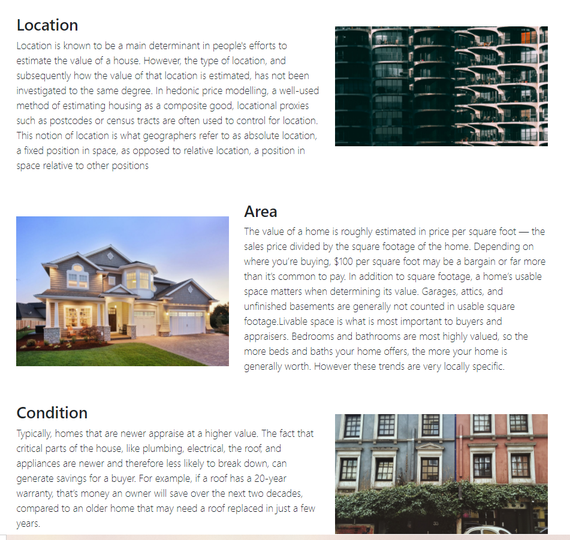
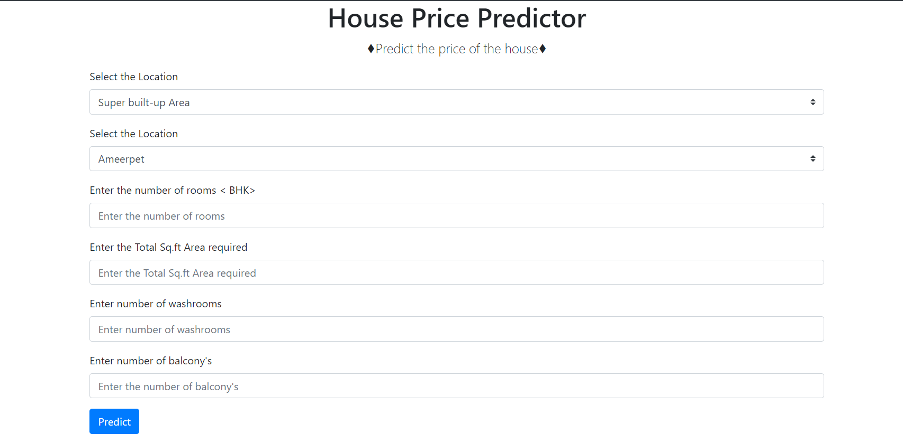
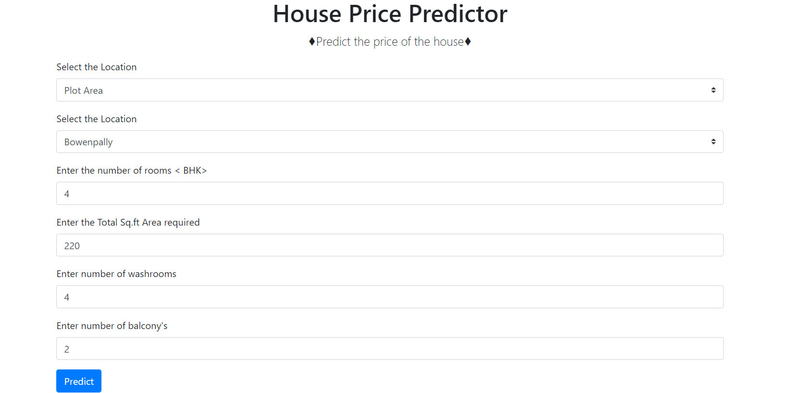

# SPS-9305-Machine-Learning-

## Hyderabad House Price Predictor

ML model which predicts the price of a house based on features like total Sq. ft area,total number of bedrooms,balconies etc.
The front-end of this model is made by boot-strap and Flask,where as the backend is a Machine learning model which is trained on the housing-price dataset on IBM Watson using the AUTO AI and the algorithm 
selected by AUTO AI was Random-Forest Regressor,here is a small glimpse of the project,

### The video presentation of the project is present at this link ↓

https://drive.google.com/file/d/12N1kmGOp5NbMSNzKWBLUaKyhme1DAuAO/view?usp=sharing

As the video is long enough,if its not displaying in the drive frame,please do download the video and have a check,regards, Team DataCrew❤

## General Overview of the Project 

Starting of with the home page which is designed using bootstrap classes,here we in this template the general overview of the project is mentioned,along with that the parameters which are required for predicting the price of the house are also mentioned here,here's a glimpse of it

Now here's a glimpse of the parameters page,which is giving the information about the parameters which are used for predicting the model,one can read the matter by clicking on param's option on the navigation,here is a small glimpse of it

After having read about the details of the parameters,its time for predicting the price of the house based on the parameters which are mentioned in the params' section,so inorder to predict the price we have to switch ourselves from the params' tab to the predict price tab,which is present in the navigation bar after the parameters tab,just click on that and here is a glimpse of the form

Here after we have to fill in the details as required and hit the predict button,here's a glimpse how it looks after filling the details in the form

Once the form is filled,hit the predict button and it will take some time as the requests made are asynchronous,as the data is been passed from the "FORM" to the IBM watsons' AUTO AI,for prediction,and as that will recieve,the result will be fetched,here is the glimpse of the output,after the result has been fetched from the IBM cloud

 The model predicts the price of the house,in (Lakh),well to be honest,as there was not much data given to the model,the predictions might not seem that good,but if more and more data was fetched we would expect better results,and that is true,as one fetches more data to the Machine Learning Model,the model will learn better insights and will perform better
 
 
 

## Contributions

L.Sai Nikhil,Vishwam gave their contributions in making the UI of the project

Meet.V,L.Sai Nikhil gave their contributions in creating the Flask server and the Machine Learning Model on the IBM cloud

Vishwam,Meet gave their contributions in formatting the document and also making the video presentation of the project.

### Technologies Used

<code></code>
<code></code>
<code></code>
<code></code>
<code></code>

Had a Great time building this model using IBM CLoud Services and AUTO AI ~ from the teammates of DataCrew❤

